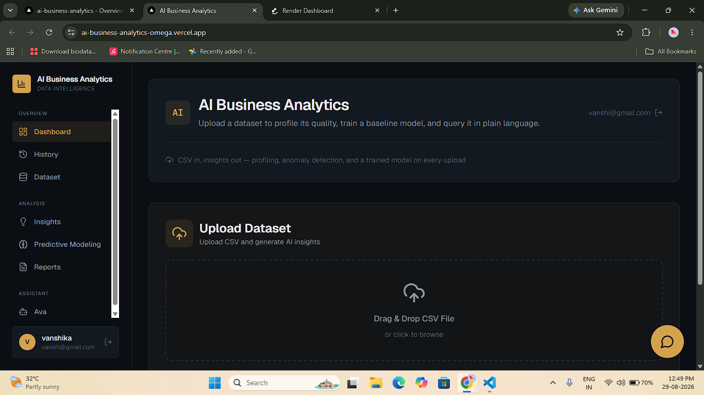
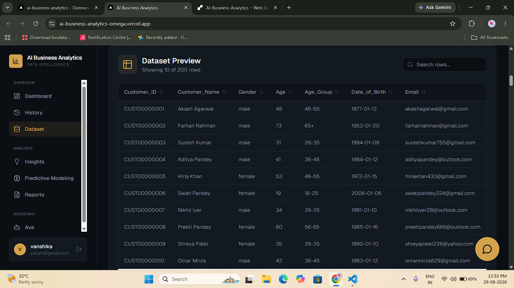
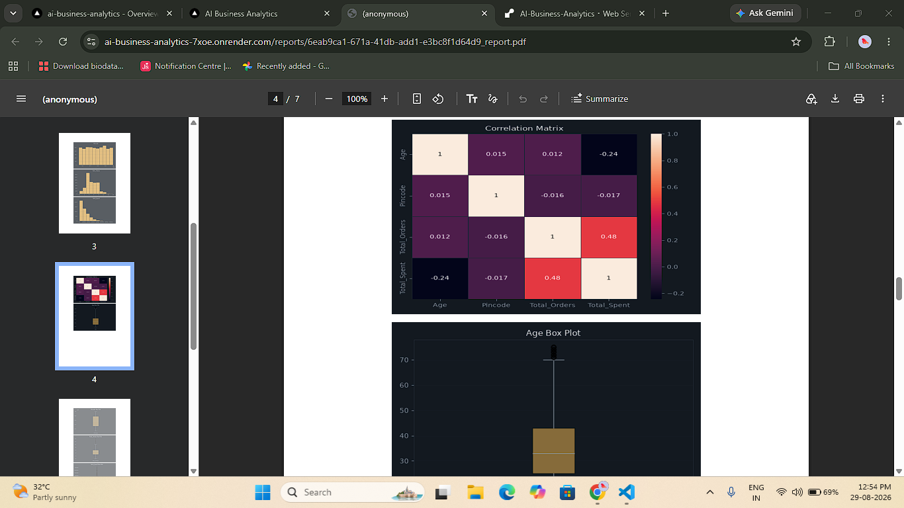
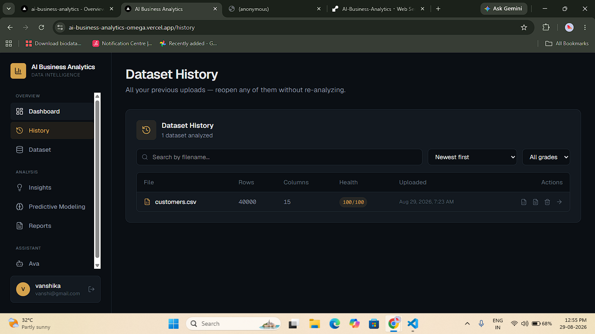
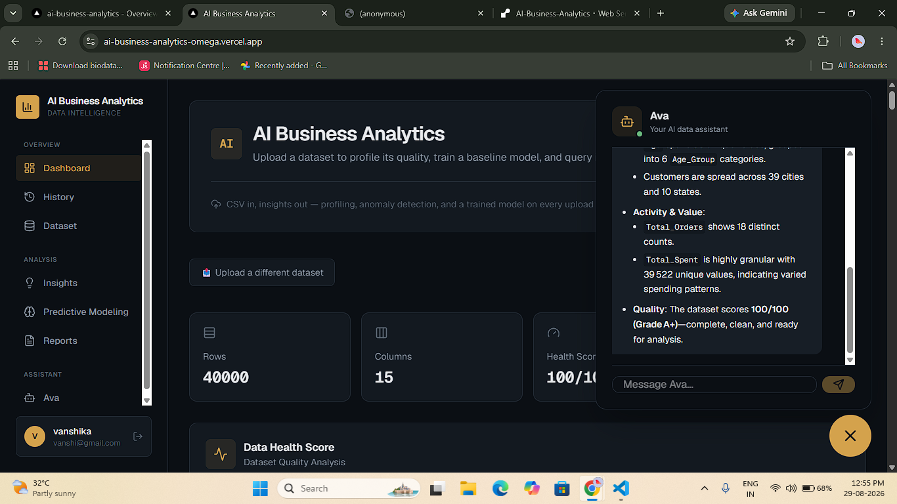

# AI Business Analytics

**AI-powered data analytics dashboard** — upload any CSV and get instant data profiling, AI-generated insights, anomaly detection, a trained predictive model, and a natural-language chat assistant that computes real answers from your data (not canned responses).

🔗 **Live demo:** [ai-business-analytics-omega.vercel.app](https://ai-business-analytics-omega.vercel.app)

> Hosted on free-tier infrastructure (Render + Vercel) — the backend may take 30–50s to wake up on the first request after inactivity.

---

## Screenshots

**Dashboard — health score, quality checks, and AI-generated recommendations on every upload**


**Dataset preview — searchable, sortable table of the raw data**


**Generated business report — auto-built PDF with correlation matrix and per-column charts**


**Dataset history — reopen or re-download any past analysis without recomputing it**


**Ava — the AI assistant, answering with real computed numbers from the dataset**


**Scenario Simulator — Bayesian-optimized recommendation with convergence and sensitivity charts**


---

## Why this project is different

Most "AI dashboard" portfolio projects wrap a single LLM call around a chart library. This one doesn't:

- **The AI can't hallucinate numbers.** Ava's query engine never lets an LLM write or execute code. Instead, the model picks from a fixed set of safe operations (`groupby_agg`, `correlation`, `filter_count`, etc.) as structured JSON, which the backend then runs with real pandas — the AI decides *what* to compute, the backend decides *how*. Every number Ava gives you is a real, verifiable computation against your uploaded data.
- **Guardrails on the ML, not just the UI.** ID-like or free-text columns are automatically excluded from the predictive-modeling target list. Small-sample results are flagged as "directional, not production-grade" instead of being presented with false confidence.
- **Handles real-world scale.** Tested end-to-end (upload → profiling → charts → training → PDF export) against a 250,000-row dataset without crashing, on a memory-constrained free-tier server — via row sampling for chart generation and model training, and explicit memory cleanup after each request.
- **Survives ephemeral hosting.** Free-tier hosts wipe local disk on every restart. Uploaded CSVs are also persisted in PostgreSQL, so a restart never breaks a saved analysis — charts and PDFs regenerate on demand if the disk copy is gone.
- **Doesn't just describe data — recommends a decision.** The Scenario Simulator turns the trained predictive model into a decision-support tool: instead of only reporting what the data shows, it searches for the business-variable combination that best drives a chosen KPI.

---

## Features

| Area | What it does |
|---|---|
| **Auth** | JWT-based register/login, protected routes |
| **Upload & Profiling** | Drag-and-drop CSV upload, automatic column typing, missing-value and duplicate detection |
| **Data Health Score** | Weighted completeness + uniqueness score, with a breakdown of what's driving it |
| **Anomaly Detection** | Z-score based outlier detection per numeric column, surfaced as its own section |
| **AI Insights** | Dataset-specific observations, correctly distinguishing "Good" findings from real "Warnings" |
| **AI Recommendations** | Data-cleaning suggestions generated from the dataset's actual stats (Groq / `openai/gpt-oss-120b`) |
| **Business Recommendations** | Problem → Evidence → Cause → Recommendation → Impact cards, grounded in the dataset |
| **Predictive Modeling** | One-click Random Forest classifier/regressor with real metrics (R², accuracy, F1, etc.) and feature importance |
| **Scenario Simulator** | Bayesian Optimization to find the variable combination that best drives a target KPI, with sensitivity analysis and multi-scenario comparison |
| **Ava — AI Assistant** | Single chat surface: computes real answers for data questions, falls back to general conversation for anything else |
| **Charts** | Auto-generated histograms, box plots, correlation heatmap, and category breakdowns, dark-themed to match the app |
| **PDF Reports** | One-click business report export, including all charts and the recommended scenario when one has been run |
| **Dataset History** | Searchable, sortable, filterable table of past uploads; reopen any analysis without recomputing; CSV/PDF re-download |
| **Onboarding** | First-time guided tips on login, register, and first dashboard visit |

---

## Tech Stack

**Frontend:** Next.js 16 (App Router), React 19, TypeScript, Tailwind CSS v4, Framer Motion, Recharts
**Backend:** FastAPI, SQLAlchemy, PostgreSQL, scikit-learn, scikit-optimize, pandas, matplotlib/seaborn, ReportLab
**AI:** Groq API (`openai/gpt-oss-120b`) for chat, summaries, and recommendations
**Auth:** JWT (python-jose), bcrypt password hashing
**Deployment:** Vercel (frontend) + Render (backend + PostgreSQL), Dockerized backend

---

## Architecture highlights

- **Safe natural-language querying** (`services/query_engine.py`): the LLM never generates or executes arbitrary code. It's constrained to selecting one of ~8 pre-defined pandas operations as JSON, validated against the actual dataset's columns before running.
- **Memory-safe on large datasets**: chart generation and model training sample down to a fixed row cap before processing, and dataframes are explicitly released after each request — necessary to stay within a 512MB memory limit on the free-tier host.
- **Ephemeral-storage resilience**: uploaded CSVs are persisted in PostgreSQL (not just disk), so charts and PDFs can always be regenerated even after a server restart wipes local files. The Scenario Simulator's PDF regeneration step re-checks chart files on disk and rebuilds them from the stored dataset if a redeploy has wiped them, rather than silently shipping a report with missing graphs.
- **One trained model, two consumers**: `services/ml_model.py` exposes an internal training function reused by both the Predictive Modeling tab and the Scenario Simulator, so the two features can never drift out of sync with two separate training implementations.

---

## Scenario Simulator (Strategic Decision Optimization)

Beyond describing a dataset, the app can recommend a decision. Pick a
numeric target KPI (e.g. Revenue) and 1-4 controllable business
variables (e.g. Price, Marketing Spend, Discount %), and the backend
searches for the combination of those variables that best drives the
target — reusing the same Random Forest trained for Predictive
Modeling, no duplicate training path.

**Why Bayesian Optimization over grid search:** each evaluation requires
a full `model.predict()` call. Grid search scales exponentially — 4
variables × 20 steps each is 160,000 evaluations. Bayesian Optimization
instead builds a Gaussian Process surrogate model of the response
surface from the points already tried, and uses an Expected Improvement
acquisition function to pick the most *informative* next point to
evaluate. This reaches a near-optimal answer in ~25 evaluations instead
of thousands — necessary on a CPU/time-constrained free-tier host, and
a better fit than a bandit/RL approach here since the search space is
continuous rather than a small fixed set of discrete actions.

**Sensitivity analysis:** after finding the best combination, each
variable is swept independently across its full observed range (holding
the others at their optimized value) to measure how much that single
lever can move the KPI on its own — the same idea as a finance "tornado
chart," computed from the trained model instead of a spreadsheet
formula. This is what answers "which lever matters most," not just
"what's the best combination."

**Flow:** Upload → Train baseline model → Optimize scenario → Result is
saved back onto the dataset and folded into the downloadable PDF report,
so the recommendation isn't stuck in the dashboard — it's in the
document a decision-maker would actually read.

```
Upload CSV → profile + train baseline model
                    ↓
  Scenario Simulator: pick target KPI + controllable variables
                    ↓
  Bayesian Optimization (skopt, Expected Improvement, ~25 evaluations)
                    ↓
  Best combination + sensitivity breakdown + convergence trace
                    ↓
  Saved to dataset record → folded into PDF report
```

**Limitation (by design, not an oversight):** only numeric controllable
variables are supported — categorical variables (e.g. Region) would need
a different search space type (`skopt.space.Categorical`), which is a
reasonable next step but was left out to keep the search space and this
first version simple.

---

## Running locally

### Backend
```bash
cd backend
python -m venv .venv
.venv\Scripts\activate          # Windows
# source .venv/bin/activate     # macOS/Linux
pip install -r requirements.txt
```

Copy `.env.example` to `.env` and fill in:
```
GROQ_API_KEY=your_groq_api_key_here      # free at console.groq.com/keys
DATABASE_URL=postgresql://...            # or leave unset to use local SQLite
JWT_SECRET=your_jwt_secret_here          # generate with: python -c "import secrets; print(secrets.token_hex(32))"
```

```bash
python -m uvicorn main:app --reload
```

### Frontend
```bash
cd frontend
npm install
npm run dev
```

Set `NEXT_PUBLIC_API_URL` in `frontend/.env.local` to your backend URL (`http://127.0.0.1:8000` for local dev).

---

## Sample dataset

A sample CSV is included in `/datasets` for quickly trying out every feature without needing your own data.

---

## Author

**Vanshika Gupta**
[GitHub](https://github.com/Vanshika-gupta001) · [LinkedIn](https://www.linkedin.com/in/vanshika-gupta-mba)